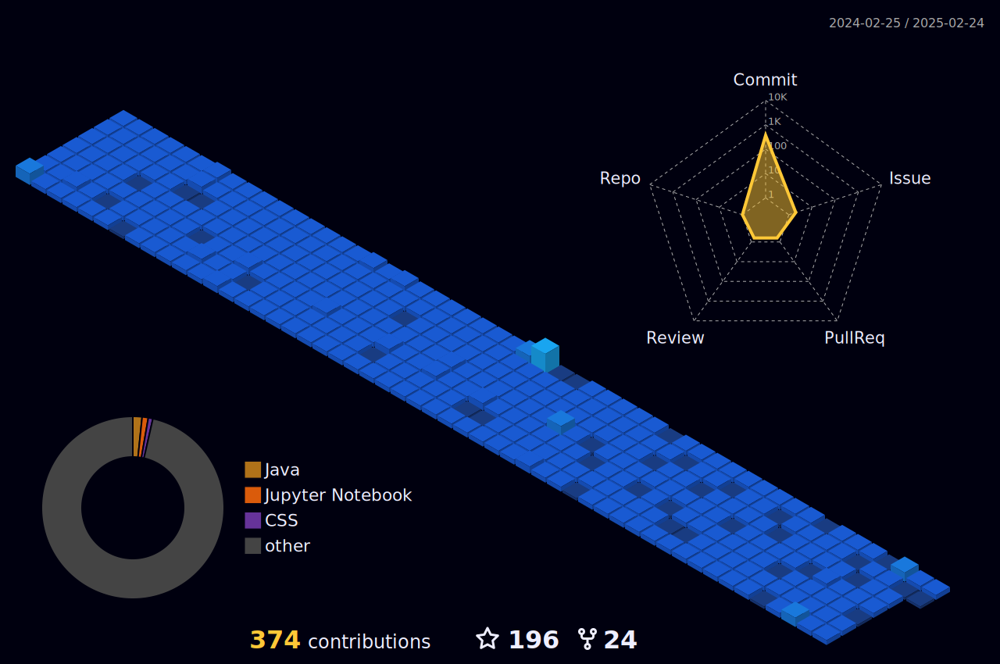

 
 
<b>Visitors Count 🌕 </b>
  

 
 

 

 

<!-- -->

<!--------------------------------------------------------------------------------------------------------------------------------------------------------->

## 𝐇𝐞𝐥𝐥𝐨 𝐭𝐡𝐞𝐫𝐞, 𝐟𝐞𝐥𝐥𝐨𝐰 <𝚌𝚘𝚍𝚎𝚛 />! 

> [!CAUTION]
> - 🔖 Congratulations you found me

> [!NOTE]
> - 🚙 I’m currently working on web development technologies like `Spring Boot`, `Angular`, `React` etc.

> [!IMPORTANT]
> - 📚 I’m currently learning **Docker, Jenkins and Grafana** 😅

> [!WARNING]  
> - 💪🏼 Future Goals: Learn more technologies, starting next with **SAP Commerce** - Never stop creating new ideas.

> [!TIP]  
> - 📗 If you're interested in collaborating or have any questions — I'd love to hear from you!

> 

>  

<!-- >    -->
>   
>   
>   
>  
> 

---

<!--Skills-->

 

<h3 align="center">
 
 
 
 【Ｓｋｉｌｌｓ】  
</h3>

 
  

| **Programming_Languages**                           | **Frontend_Tools**                                      | **Backend_Tools**                                       | **Data_Related**                                      | **IDEs/Softwares**                                           | **Other_Tools**                                    |
| --------------------------------------------------- | -------------------------------------------------- | -------------------------------------------------- | -------------------------------------------------- | ---------------------------------------------------- | -------------------------------------------------- |
| 
 
| 
  
| 
 | 
 |
  |  
  |
| 
 | 
 | 
 | 
  |
  | 
  |
| 
 | 
  | 
 |  
 | 
 |
   |
|
  | 
 |
  |  
                                                  |
  | 
  |
| 
 | 
 | 
 |  
  |
  |
   |
| 
  |
 |
  | 
  | 
  | 
                                                  |                                            |
| 
 |
 | 
 | 
    |  
       |  
  |                                                 |

<!--STATS-->

<h3 align="center">
   【Ｓｔａｔｓ】 

</h3>

 

  

 
<a href="https://user-badge.committers.top/morocco/JosueIsOffline"> 
<!--       -->
</a>

 

 

 <!--More Stats-->

 

  
📈 More Stats

   
 

 <a href="https://github.com/JosueIsOffline"> 
   

  
  
 </a>
<a href="https://github.com/JosueIsOffline"> 
   
  </a> 
  
 <!--  -->

 
   
  
 

<a href="https://youtube.com/shorts/HWNQxME4r5E?feature=share"> 

  

<!--      
      -->
</a> 
 

<!--------------------------------------------------------------------------------------------------------------------------------------------------------->

## <b> Let's Connect..!</b>

 

 
 
 

<!--------------------------------------------------------------------------------------------------------------------------------------------------------->

