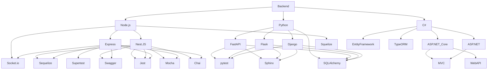

<!-- -->A
 


<!--------------------------------------------------------------------------------------------------------------------------------------------------------->
## <picture></picture> **About me**

```javascript
   const josue = {
    pronouns: "He" | "Him",
    bio: "¡Hola! Soy Josué Hernández, un apasionado del desarrollo de aplicaciones y tecnología en general.
           Me gusta explorar nuevas tecnologías y trabajar en proyectos desafiantes.",
    current_university: "Instituto Tecnologico de las Americas (ITLA)",
    askMeAbout: ["app dev", "web dev", "tech"],
    technologies:{
        backEnd: ["nodejs", "express", "python", /* Aquí puedes agregar tus tecnologías backend */],
        fronEnd: ["angular"],
        mobileApp: ["ionic","angular"],
        database: ["mongo","mySql"],
        serverless: ["mongo-realm","aws-lambda"],
        devOps: ["AWS", "Nginx", "Jenkins"],
        misc: ["Firebase", "Socket.IO"]
    },
    architecture: ["Serverless Architecture", "microservices", "event-driven", "Single page applications"],
}
```

<!--------------------------------------------------------------------------------------------------------------------------------------------------------->
<h1 align="center">Github Metrics </h1><p align="center">

</p>

<!--------------------------------------------------------------------------------------------------------------------------------------------------------->

<table align="center">
  <tr>
    <td>
      
    </td>
    <td>
      
    </td>
  </tr>
</table>

<!--------------------------------------------------------------------------------------------------------------------------------------------------------->

<div align="center">
<br><p align="centre"><b>Visitors Count 👽 </b></p>  
<p align="center"></p> 
<br>
</div>

<!--------------------------------------------------------------------------------------------------------------------------------------------------------->



<!--------------------------------------------------------------------------------------------------------------------------------------------------------->

<p align="center">
 
  

 
   
   
    
   
  
  
   
  
  
  
  
  
   
   
   
   
   
   
   

   
   
   
   
  
<p/>

<!--------------------------------------------------------------------------------------------------------------------------------------------------------->


